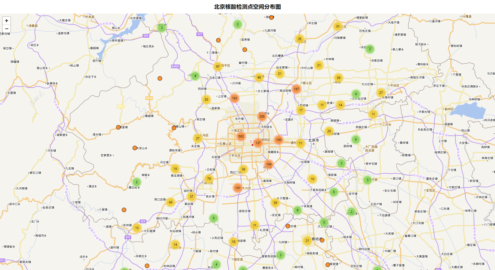
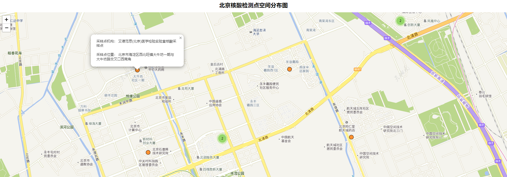

# Nucleic Acid POI mapping and application

核酸检测点POI制图和地图应用项目。

## data

5月北京市的核酸检测点测试数据。


## hs-poi

核酸检测点poi数据Python获取方式。

坐标库转换库参考：https://github.com/wandergis/coordTransform_py

环境和依赖：

- Python3.8
- request
- geopandas
- pandas

## hs-demo

核酸检测点poi数据leaflet可视化（Vue+Leaflet）。

- 下载依赖

  ```
  npm install
  ```

- 启动工程

  ```
  npm run serve
  ```

访问localhost:8888，显示核酸空间分布图。


